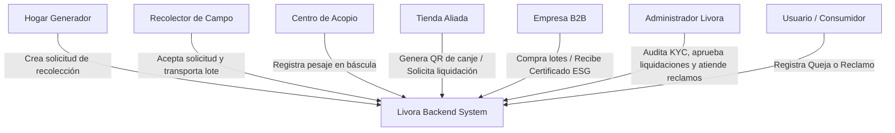
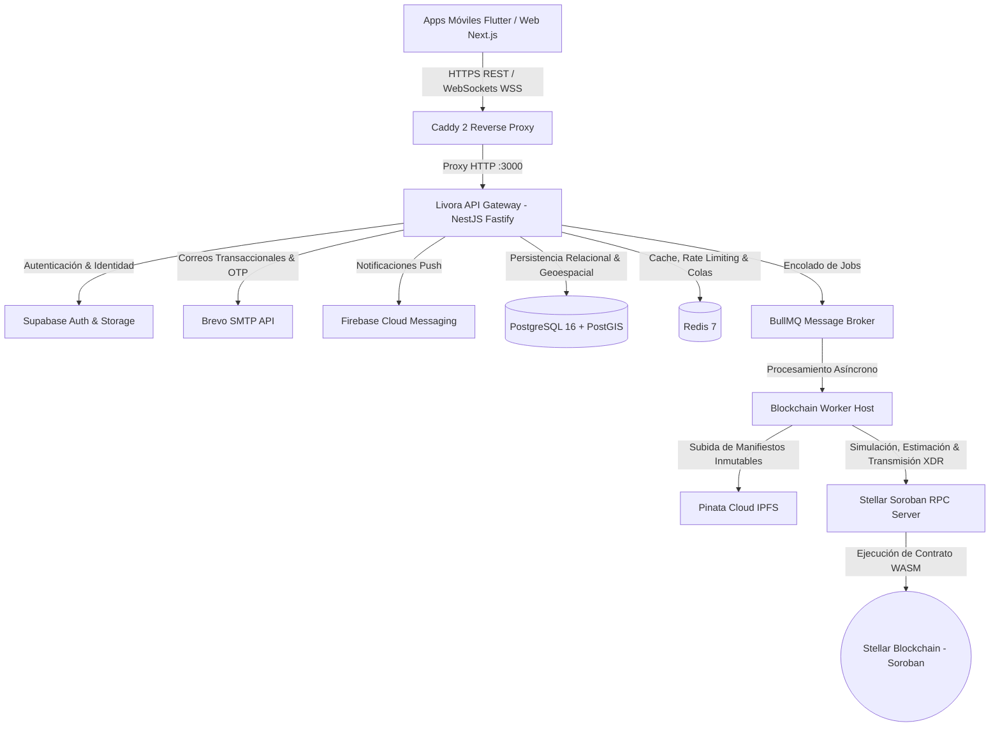
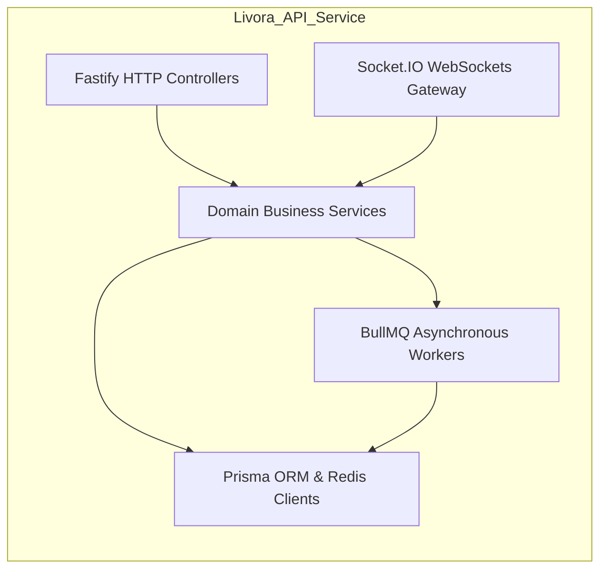
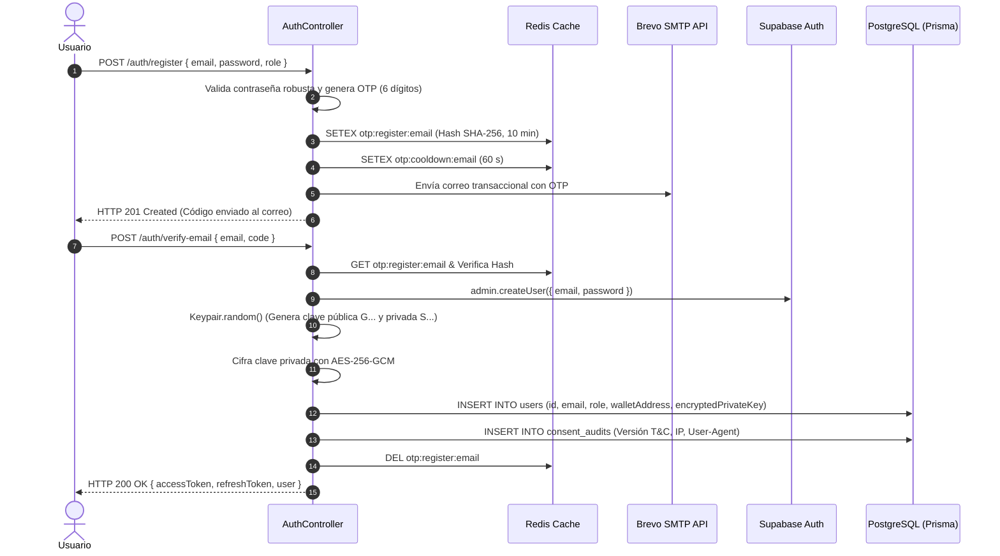
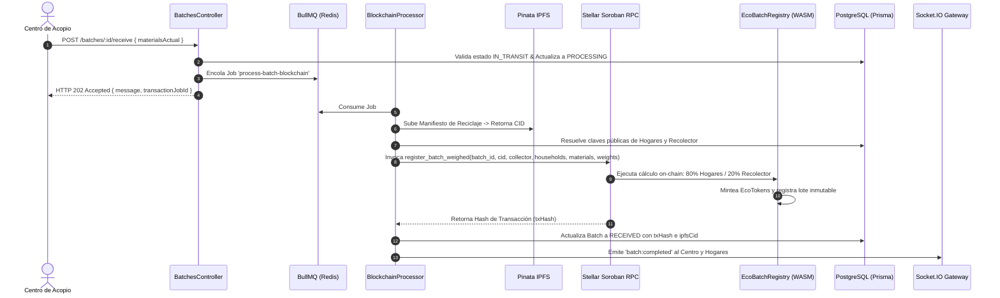
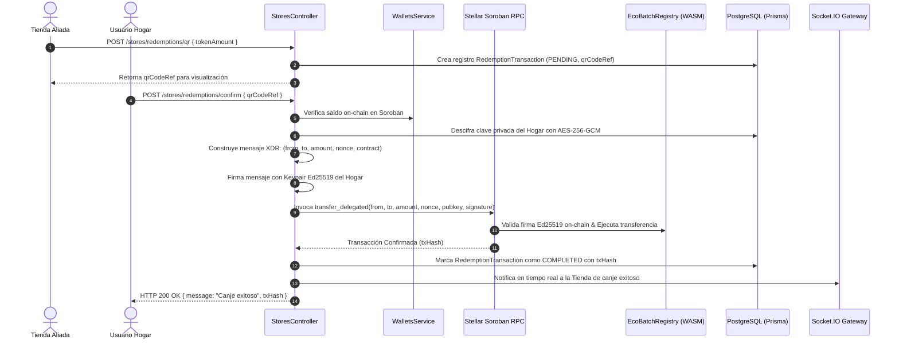
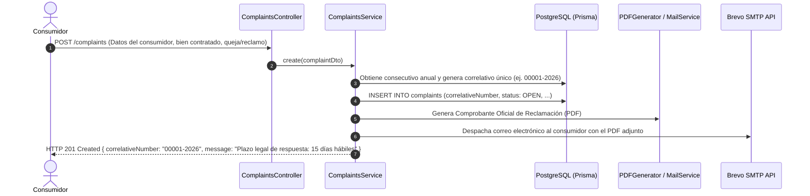
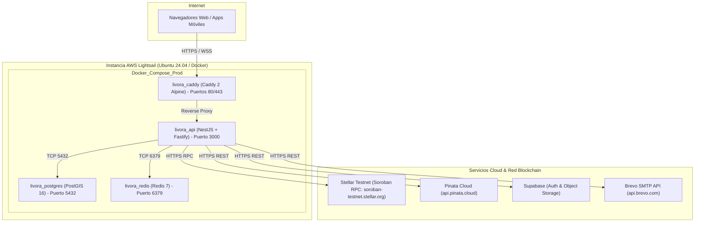

# INFORME DE ARQUITECTURA DE SOFTWARE (arc42) — LIVORA API SERVICE

**Proyecto:** Livora — Plataforma de Reciclaje Trazable con Incentivos Web3 en Stellar  
**Sistema:** `Livora-api-service` (API Gateway, Core Monolith & Blockchain Worker)  
**Versión del Documento:** 3.0.0 (Migración Definitiva a Stellar/Soroban & Compliance Legal)  
**Fecha:** 2026-08-29  
**Estándar:** arc42 (Architecture Communication Canvas — Version 8.2)  
**Estado:** Producción / Auditado  

---

## 1. Introducción y Objetivos (Introduction & Goals)

### 1.1 Resumen del Sistema (Requirements Overview)
**Livora** es un ecosistema digital de reciclaje circular que transforma cada kilogramo de residuo reciclable en un hecho verificable en la blockchain de **Stellar (Soroban)** y en una recompensa económica líquida (**EcoTokens - ECO**).

El backend `Livora-api-service` actúa como el motor central que orquesta:
- El registro e identidad de actores (Hogares, Recolectores, Centros de Acopio, Tiendas Aliadas, Empresas B2B, Almacenes y Administradores).
- La trazabilidad física y logística de los residuos mediante geolocalización PostGIS y validación con PINs de seguridad.
- La ingesta de pesajes industriales en báscula y el cálculo transparente on-chain de incentivos (80% para hogares generadores, 20% para recolectores).
- El minteo y transferencia de tokens en el contrato inteligente **`EcoBatchRegistry`** (Rust/WASM) compatible con el estándar **SEP-41**.
- El marketplace de canje en comercios mediante códigos QR y transferencias delegadas sin fricción de comisiones de red (*gasless/fee-subsidized*).
- El cumplimiento regulatorio peruano (Libro de Reclamaciones Virtual según Ley 29571/32495 y Protección de Datos Personales según Ley 29733).

### 1.2 Objetivos de Calidad (Quality Goals)

| Prioridad | Objetivo de Calidad | Motivación y Métrica Clave |
| :--- | :--- | :--- |
| **1** | **Integridad Financiera & Trazabilidad On-Chain** | Cero inconsistencias entre los pesos registrados en báscula física y las recompensas acuñadas en Stellar Soroban. Idempotencia del 100% en lotes. |
| **2** | **Baja Fricción UX (Web3 Abstraction)** | Experiencia *Gasless* para hogares y tiendas. El usuario nunca gestiona XLM ni transacciones directas; el backend custodia de forma segura las claves y subsidia comisiones. |
| **3** | **Rendimiento & Throughput (API Fastify)** | Respuesta de pesaje en báscula en < 200 ms (patrón HTTP 202 Accepted con BullMQ). Gateway optimizado con Fastify. |
| **4** | **Tolerancia a Fallos y Resiliencia (Circuit Breaker)** | Aislamiento de caídas o latencias en endpoints RPC públicos de Stellar mediante Circuit Breaker (Opossum) y colas de reintento. |
| **5** | **Cumplimiento Legal y Normativo (Perú)** | Conformidad estricta con Indecopi (Libro de Reclamaciones con correlativo único y PDF automático) y ANPD (auditoría de consentimiento y derechos ARCO). |

### 1.3 Partes Interesadas (Stakeholders)

| Rol / Actor | Interés Principal en la Arquitectura |
| :--- | :--- |
| **Hogares (`HOGAR`)** | Facilidad de solicitud, seguridad de sus datos y visualización instantánea de su saldo de EcoTokens. |
| **Recolectores (`RECOLECTOR`)** | Asignación de solicitudes cercanas en tiempo real, consolidación rápida de lotes y pago del 20% del valor reciclado. |
| **Centros de Acopio (`CENTRO_ACOPIO`)** | Ingesta instantánea de pesajes en báscula, gestión de inventario en planta y consolidación para ventas B2B. |
| **Tiendas Aliadas (`TIENDA`)** | Validación rápida de canjes mediante QR y liquidación transparente de EcoTokens a moneda local (Soles). |
| **Empresas B2B (`EMPRESA_B2B`)** | Certificados de impacto ESG respaldados por hashes inmutables de IPFS. |
| **Autoridades Regulatorias (Indecopi / ANPD)** | Disponibilidad del Libro de Reclamaciones Virtual, plazo de atención <= 15 días hábiles y trazabilidad del consentimiento de privacidad. |

---

## 2. Restricciones de la Arquitectura (Architecture Constraints)

### 2.1 Restricciones Técnicas
- **Plataforma:** Node.js 22 LTS, NestJS 11 con adaptador `@nestjs/platform-fastify`.
- **Blockchain:** Stellar Soroban (Testnet / Mainnet) utilizando `@stellar/stellar-sdk` y contratos en Rust compilados a WASM (`soroban-sdk` v21).
- **Persistencia:** PostgreSQL 16 con extensión geoespacial PostGIS y Prisma ORM.
- **Cache & Broker:** Redis 7 (BullMQ para workers y adapter de Socket.IO).
- **Almacenamiento Descentralizado:** IPFS a través de la API REST de Pinata Cloud.

### 2.2 Restricciones Legales y Normativas (República del Perú)
En cumplimiento de las normas obligatorias del proyecto:
1. **Ley N.º 29733 (Protección de Datos Personales):**
   - Banco de datos "Usuarios de la Plataforma" registrado ante la ANPD.
   - Checkboxes de consentimiento desmarcados por defecto y diferenciados (Términos/Privacidad obligatorio, Publicidad opcional).
   - Tabla de auditoría `consent_audits` para almacenar versión de términos, IP, User-Agent y timestamp.
   - Mecanismo de Soft-Delete (`deletedAt`) para ejercicio de derechos ARCO.
2. **Ley N.º 29571 / Ley N.º 32495 (Libro de Reclamaciones Virtual):**
   - Acceso permanente en footer y perfil.
   - Generación de número correlativo oficial único en formato `XXXXX-AAAA` (ej. `00001-2026`).
   - Envío automático de copia en PDF al correo del reclamante al momento del registro.
   - Plazo máximo de atención legal de 15 días hábiles no prorrogables.
3. **Custodia y Delegación Web3:**
   - Claves privadas custodiadas cifradas en reposo con **AES-256-GCM**.
   - Cláusulas contractuales de mandato de delegación irrevocable para firma en nombre del usuario basada exclusivamente en instrucciones en la UI.
   - Declaración expresa de irreversibilidad de transacciones on-chain y naturaleza no fiat del EcoToken.

---

## 3. Contexto y Alcance (System Scope & Context)

### 3.1 Contexto de Negocio



### 3.2 Contexto Técnico (C4 Context Diagram)



---

## 4. Estrategia de Solución (Solution Strategy)

| Decisión Arquitectónica | Justificación Técnica |
| :--- | :--- |
| **Micro-Monolito Modular en NestJS** | Combina la velocidad de desarrollo de un monolito con la alta cohesión y bajo acoplamiento de microservicios mediante módulos autocontenidos. |
| **Fastify Engine sobre Express** | Multiplica el rendimiento de I/O en un ~200% y reduce la huella de memoria en el runtime de Node.js. |
| **Patrón HTTP 202 con BullMQ** | Evita timeouts en clientes móviles y centros de acopio durante las operaciones on-chain lentas en Stellar y anclajes en IPFS. |
| **Stellar Soroban (Rust/WASM)** | Costos de transacción casi nulos (< \$0.0001), finalización rápida (bloques de ~5s) y estándar de token nativo **SEP-41**. |
| **Custodia Segura AES-256-GCM + Firma Ed25519** | Elimina la barrera de adopción Web3. El usuario no necesita extensiones de wallet ni comprar criptomonedas para operar. |
| **Circuit Breaker (Opossum)** | Protege el backend contra fallos transitorios de los nodos públicos RPC de Stellar, degradando de forma controlada. |

---

## 5. Vista de Bloques de Construcción (Building Block View)

### 5.1 Nivel 1: Estructura General del Backend



### 5.2 Nivel 2: Módulos del Sistema (26 Módulos NestJS + Smart Contract)

```
src/
├── admin/                  # Gestión de usuarios, KYC, métricas y salud del sistema
├── auth/                   # Registro OTP en 2 pasos, Login, JWT, Refresh Tokens y Brevo
├── b2b/                    # Solicitudes de afiliación y transferencias comerciales B2B
├── batches/                # Ciclo de vida de lotes (OPEN -> IN_TRANSIT -> RECEIVED) y consolidaciones
├── beta/                   # Waitlist y registro a la beta pública
├── blockchain/             # Stellar Soroban SDK, Worker BullMQ, Pinata IPFS y Circuit Breaker
├── centers/                # Perfiles de Centros de Acopio y PIN de recepción
├── certificates/           # Certificados ESG de impacto ambiental vinculados a IPFS
├── collection-requests/    # Solicitudes domiciliarias con geolocalización PostGIS y PIN
├── collections/            # Agrupador del módulo de recolecciones
├── common/                 # Guards (Roles), Interceptors (IPFS), Filters (Global), Utils (Crypto)
├── complaints/             # Libro de Reclamaciones Virtual (Ley 29571 / 32495)
├── health/                 # Health checks de PostgreSQL, Redis y Stellar RPC
├── inventory/              # Control de stock físico en planta y movimientos IN/OUT
├── kyc/                    # Verificación documental de recolectores
├── metrics/                # Dashboards de impacto ecológico por rol
├── notifications/          # Notificaciones in-app y Firebase Cloud Messaging
├── prisma/                 # Servicio de conexión y transacciones con PostgreSQL
├── redis/                  # Singleton de cliente ioredis para cache y locks
├── sales/                  # Registro de ventas de lotes industriales a empresas
├── stores/                 # Perfiles de tiendas, canjes QR y solicitudes de liquidación
├── supabase/               # Integración de identidad y almacenamiento Supabase
├── uploads/                # Gestión de subida de archivos multipart
├── users/                  # Perfiles de usuario, consentimientos y soft-delete
├── wallets/                # Saldos EcoToken SEP-41 y transacciones subsidiadas
└── websockets/             # Gateway Socket.IO con Redis Adapter
```

### 5.3 Nivel 3: Componentes Críticos

#### 1. `BlockchainService` & `BlockchainProcessor`
- **Ubicación:** `src/blockchain/services/blockchain.service.ts` y `src/blockchain/blockchain.processor.ts`.
- **Responsabilidad:** Gestionar la interacción con Soroban RPC, simular transacciones, ensamblar XDR, firmar con la clave secreta del Worker y procesar la cola de fondo.
- **Circuit Breaker:** Protegido con `Opossum` (timeout de 10s, umbral de error del 50%, ventana deslizante de 10 cubos).

#### 2. `EcoBatchRegistry` (Soroban Smart Contract)
- **Ubicación:** `contracts/ecotoken_registry/src/lib.rs`.
- **Responsabilidad:** Contrato en Rust WASM que almacena el balance SEP-41 de EcoTokens y ejecuta `register_batch_weighed` aplicando las tarifas de materiales y la división 80/20.

#### 3. `ComplaintsService` (Libro de Reclamaciones)
- **Ubicación:** `src/complaints/complaints.service.ts`.
- **Responsabilidad:** Generar correlativo anualizado (`00001-2026`), persistir en PostgreSQL, generar PDF y despachar por correo electrónico al usuario vía Brevo.

---

## 6. Vista de Ejecución (Runtime View)

### 6.1 Escenario 1: Registro de Usuario con OTP en 2 Pasos y Creación Custodial de Billetera



### 6.2 Escenario 2: Pesaje Industrial, Encolado Asíncrono y Minteo On-Chain (80/20)



### 6.3 Escenario 3: Canje Web3 en Tienda Aliada vía QR con Firma Delegada (Gasless)



### 6.4 Escenario 4: Registro y Procesamiento del Libro de Reclamaciones Virtual



---

## 7. Vista de Despliegue (Deployment View)

### 7.1 Topología de Despliegue en Producción (AWS Lightsail)



---

## 8. Conceptos Transversales (Cross-cutting Concepts)

### 8.1 Seguridad y Criptografía
1. **Cifrado en Reposo (AES-256-GCM):**
   - Utilizado para las claves privadas de Stellar de las billeteras custodiales.
   - IV aleatorio de 12 bytes por registro + AuthTag de 16 bytes.
   - Clave maestra derivada con SHA-256 a partir de `WALLET_ENCRYPTION_KEY`.
2. **Firmas Digitales Ed25519:**
   - Curva Edwards Ed25519 nativa de Stellar para la firma de mensajes fuera de cadena en el flujo `transfer_delegated`.
3. **Seguridad Perimetral HTTP:**
   - `FastifyHelmet` para cabeceras HTTP seguras (X-Frame-Options, X-Content-Type-Options, HSTS).
   - `ValidationPipe` estricto con `whitelist: true` y `forbidNonWhitelisted: true`.
   - Rate limiting multicapa con `@nestjs/throttler` y almacenamiento en Redis (`default: 100/min`, `auth_strict: 5/min`, `complaints: 3/hora`).

### 8.2 Observabilidad y Manejo de Excepciones
1. **Estandarización de Errores (RFC 9457):**
   - `GlobalExceptionFilter` intercepta todas las excepciones y retorna respuestas uniformes `{ error: { code, message, details } }`.
2. **Monitoreo de Errores con Sentry:**
   - Configurado en `instrument.ts` con `@sentry/nestjs`.
   - Captura automática de errores 500 (`InternalServerErrorException`) con stack traces completos.
3. **Health Checks Compuestos (`/health`):**
   - Validación periódica en tiempo real de Base de Datos (`SELECT 1`), Redis (`PING = PONG`) y Stellar RPC (`rpcServer.getHealth()`).

---

## 9. Registro de Decisiones de Arquitectura (ADRs)

### ADR-001: Migración de EVM / Arbitrum a Stellar Soroban
- **Contexto:** La versión inicial utilizaba Arbitrum Stylus. Sin embargo, los costos de gas y la complejidad de gestión de cuentas EVM generaban fricciones para la inclusión financiera de recicladores.
- **Decisión:** Migrar todo el ecosistema Web3 a **Stellar Soroban**.
- **Consecuencias Positivas:** Comisiones de red casi nulas, token estándar SEP-41, finalización en ~5 segundos y firma delegada Ed25519 nativa.

### ADR-002: Billeteras Custodiales con Firma Delegada Gasless
- **Contexto:** Los usuarios de hogares y recolectores no poseen conocimientos de Web3 ni fondos en criptomonedas para pagar comisiones de transacción.
- **Decisión:** Implementar billeteras custodiales gestionadas por el backend con claves privadas cifradas en AES-256-GCM y un Worker Relayer pagador.
- **Consecuencias Positivas:** Cero fricción de onboarding; adopción inmediata idéntica a una aplicación Web2.

### ADR-003: Procesamiento Asíncrono con BullMQ para Pesaje en Báscula
- **Contexto:** La interacción con la blockchain y la subida de archivos a IPFS pueden tomar de 3 a 10 segundos, lo que causaría bloqueos en los terminales de pesaje de los centros de acopio.
- **Decisión:** Responder con HTTP `202 Accepted` de inmediato y delegar el minteo y anclaje a workers de BullMQ.
- **Consecuencias Positivas:** Disponibilidad del 100% de la báscula y desacoplamiento de la latencia externa.

### ADR-004: Almacenamiento Híbrido On-Chain / Off-Chain con Manifiestos IPFS
- **Contexto:** Almacenar los desgloses granulares de cada material en la blockchain genera saturación de estado (*State Bloat*).
- **Decisión:** Subir el manifiesto JSON detallado a IPFS (Pinata) y registrar en el contrato únicamente los pesos, tarifas y el hash `ipfs_cid`.
- **Consecuencias Positivas:** Máxima eficiencia de almacenamiento on-chain con inmutabilidad y auditabilidad verificable.

### ADR-005: Cumplimiento Normativo Peruano (Libro de Reclamaciones y ANPD)
- **Contexto:** La legislación peruana impone requerimientos estrictos para plataformas de e-commerce y servicios digitales.
- **Decisión:** Integrar el Libro de Reclamaciones Virtual en la API con generación de PDF y correlativo único `XXXXX-AAAA`, junto con trazabilidad de consentimientos en `consent_audits`.
- **Consecuencias Positivas:** Cumplimiento total frente a Indecopi y ANPD, mitigando riesgos de sanciones legales.

---

## 10. Requerimientos de Calidad (Quality Requirements)

### 10.1 Árbol de Calidad (ISO/IEC 25010)

```
Calidad del Sistema Livora
├── Rendimiento & Eficiencia
│   ├── Latencia de API < 100 ms en endpoints de lectura
│   └── Procesamiento asíncrono de pesaje < 200 ms (HTTP 202)
├── Seguridad
│   ├── Cifrado AES-256-GCM para llaves privadas
│   ├── Autenticación OTP por correo con Brevo
│   └── Rate limiting distribuido en Redis
├── Confiabilidad & Resiliencia
│   ├── Circuit Breaker para llamadas RPC a Stellar
│   └── Idempotencia estricta en el procesamiento de lotes
├── Mantenibilidad
│   ├── Estructura modular en 26 módulos NestJS
│   └── Tipado estricto en TypeScript y Rust
└── Cumplimiento Legal
    ├── Libro de Reclamaciones Virtual con PDF y plazo legal de 15 días
    └── Registro de Auditoría de Consentimiento de Datos Personales
```

---

## 11. Riesgos y Deuda Técnica (Risks & Technical Debt)

| Riesgo / Deuda Técnica | Impacto | Estado / Plan de Mitigación |
| :--- | :--- | :--- |
| **Dependencia de Endpoints RPC Públicos de Stellar** | Alto | **Mitigado:** Implementación del Circuit Breaker `Opossum` con fallback y reintentos en BullMQ. Recomendado desplegar un nodo Soroban RPC privado para producción masiva. |
| **Gestión Custodial Centralizada de Claves** | Medio-Alto | **Mitigado:** Claves cifradas con AES-256-GCM y clave maestra en variables de entorno seguras. Evolución futura hacia KMS / HSM (AWS KMS o HashiCorp Vault). |
| **Costos de Cómputo en Interceptor IPFS Global** | Bajo | **Monitoreado:** `IpfsGatewayInterceptor` analiza respuestas para inyectar URLs de gateway. Se recomienda migrar a un decorador `@IpfsResponse()` para restringir su ejecución a controladores pertinentes. |

---

## 12. Glosario (Glossary)

| Término | Definición en el Contexto de Livora |
| :--- | :--- |
| **EcoToken (ECO)** | Token fungible de incentivo ecológico emitido en Stellar Soroban conforme al estándar **SEP-41** (divisible a 7 decimales / Stroops). |
| **EcoBatchRegistry** | Contrato inteligente en Rust desplegado en Soroban que registra lotes, aplica tarifas de materiales y mintea tokens con la regla 80/20. |
| **SEP-41** | *Stellar Ecosystem Proposal 41*: Estándar oficial de interfaz de tokens fungibles para Soroban (equivalente a ERC-20 en Ethereum). |
| **Firma Delegada (`transfer_delegated`)** | Mecanismo mediante el cual un usuario autoriza una transferencia firmando un mensaje XDR con su clave Ed25519 fuera de cadena, y el Relayer ejecuta y paga la transacción. |
| **Relayer / Worker** | Billetera operativa de Livora que subsidia las tarifas de gas en XLM y firma las transacciones del sistema. |
| **PostGIS** | Extensión espacial para PostgreSQL que permite calcular distancias esféricas (`ST_DistanceSphere`) para emparejar recolectores con solicitudes cercanas. |
| **Libro de Reclamaciones Virtual** | Registro digital oficial exigido por Indecopi (Leyes 29571 y 32495) para interponer quejas o reclamos, con entrega de hoja de reclamación en PDF y respuesta en 15 días hábiles. |
| **Derechos ARCO** | Derechos de Acceso, Rectificación, Cancelación y Oposición garantizados por la Ley N.º 29733 de Protección de Datos Personales en el Perú. |
