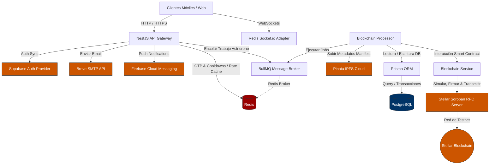

# AUDITORÍA DE ARQUITECTURA Y ESTADO ACTUAL (AS-IS): BACKEND LIVORA (NESTJS + STELLAR)

> 📘 **Documento Oficial arc42:** Para consultar la especificación canónica y completa de arquitectura del sistema en sus 12 secciones oficiales bajo el estándar arc42, consulte el archivo [`docs/arc42-architecture-report.md`](arc42-architecture-report.md).

**Rol:** Principal Backend Architect & Staff Engineer  
**Fecha:** 2026-08-24 (Actualizado: 2026-08-29)  
**Proyecto:** Livora API Service (Migración EVM -> Stellar/Soroban)  

---

## 1. RESUMEN EJECUTIVO
Este informe presenta una radiografía técnica del backend de la plataforma de reciclaje trazable **Livora**. La arquitectura actual está construida sobre **NestJS** e integra tecnologías robustas como **Prisma (PostgreSQL)**, **Redis** para caching/OTP, **BullMQ** para procesamiento asíncrono y la blockchain de **Stellar (Soroban)** mediante su SDK oficial. 

Se ha detectado que la base del sistema está bien estructurada utilizando las mejores prácticas de modularidad de NestJS. Sin embargo, existen importantes oportunidades de mejora de seguridad e integridad en la capa de integración de Blockchain, lógica acoplada, código huérfano (EVM) y observabilidad para alcanzar estándares de grado empresarial.

---

## 2. MAPA DE COMPONENTES (AS-IS)
El siguiente diagrama detalla cómo interactúan los componentes del backend y los servicios de terceros durante los flujos críticos de la aplicación:



---

## 3. ANÁLISIS POR DIMENSIONES

### 3.1. Arquitectura y Patrones de Diseño Core
* **Estructura Modular (NestJS):** La aplicación está segmentada limpiamente en 21 módulos autocontenidos. Destacan áreas clave del negocio como `AuthModule`, `BatchesModule`, `WalletsModule`, `StoresModule`, `PrismaModule`, `RedisModule` y `BlockchainModule`.
* **Inyección de Dependencias (DI):** Se utiliza de manera nativa y consistente en todo el proyecto. Los controladores (e.g., [`auth.controller.ts`](file:///c:/Users/Acer/Desktop/Estudio/Proyectos/Livora-ToStellar/Livora-api-service/src/auth/auth.controller.ts)) delegan la lógica a los servicios (e.g., [`auth.service.ts`](file:///c:/Users/Acer/Desktop/Estudio/Proyectos/Livora-ToStellar/Livora-api-service/src/auth/auth.service.ts)), los cuales son singleton inyectados.
* **Patrón Repository con Prisma:** No se implementa una capa abstracta o genérica adicional de repositorios (e.g., Custom Repositories). En su lugar, se inyecta directamente [`PrismaService`](file:///c:/Users/Acer/Desktop/Estudio/Proyectos/Livora-ToStellar/Livora-api-service/src/prisma/prisma.service.ts) en cada servicio de negocio, invocando el API nativo de Prisma (e.g., `this.prisma.batch.findMany`). Esto es aceptable en ecosistemas Node.js puesto que el cliente de Prisma actúa internamente como un repositorio dinámico.
* **Colas Asíncronas (BullMQ):** Implementado en [`blockchain.processor.ts`](file:///c:/Users/Acer/Desktop/Estudio/Proyectos/Livora-ToStellar/Livora-api-service/src/blockchain/blockchain.processor.ts) extendiendo de `WorkerHost`. Desacopla las operaciones lentas de blockchain del ciclo HTTP. Cuando un Centro de Acopio recibe un lote, el backend responde con HTTP `202 Accepted` de inmediato, y la transacción se procesa en segundo plano.

---

### 3.2. Capa de Integración Web3 (Stellar / Soroban)
* **Consumo de `@stellar/stellar-sdk`:** El servicio [`blockchain.service.ts`](file:///c:/Users/Acer/Desktop/Estudio/Proyectos/Livora-ToStellar/Livora-api-service/src/blockchain/services/blockchain.service.ts) implementa la comunicación con Soroban. Utiliza transacciones simuladas (`simulateTransaction`) para estimar los recursos, ensambla las transacciones (`assembleTransaction`), firma localmente y las transmite al servidor RPC (`sendTransaction`).
* **Gestión de Claves del Relayer (`WORKER_SECRET_KEY`):**
  - La clave secreta del Relayer se carga desde variables de entorno.
  - Se genera un objeto `Keypair` (`Keypair.fromSecret(workerSecretKey)`).
  - Si la variable no está configurada, genera una clave aleatoria en memoria (`Keypair.random()`) con fines defensivos en entornos locales.
* **Firma de Transacciones Delegadas (Ed25519):**
  - Se implementa en `processRedemptionTransfer`.
  - El backend almacena las claves privadas de los usuarios de tipo `HOGAR` de forma cifrada en la base de datos (PostgreSQL: `encryptedPrivateKey`) usando **AES-256-GCM** y un vector de inicialización de 12 bytes.
  - Al realizar un canje en tiendas, el backend recupera la clave cifrada, la descifra usando la clave maestra `WALLET_ENCRYPTION_KEY`, obtiene el Nonce de la cuenta en Stellar, construye un mensaje serializado XDR (`[from, to, amount, nonce, contract]`), lo firma y envía la firma a través de la función del contrato `transfer_delegated`.
* **Resiliencia en Llamadas RPC:**
  - **Crítico:** No existe resiliencia nativa en las llamadas de bajo nivel. Los métodos `getSourceAccount`, `simulateTransaction` y `sendTransaction` no cuentan con reintentos automáticos ni manejo de fallos temporales (transient errors) de red de cara a los endpoints RPC. Si el nodo de Stellar falla o expira por timeout, la transacción se aborta arrojando un error inmediato.

---

### 3.3. Seguridad, Autenticación y Hardening
* **Registro OTP y Redis:**
  - **Registro Temporal:** Al invocar `/auth/register`, los datos del DTO y el hash SHA-256 del código OTP generado de 6 dígitos se guardan en Redis (`otp:register:${email}`) con un tiempo de expiración (TTL) de 10 minutos (600 segundos).
  - **Cooldown:** Se crea un registro `otp:cooldown:${email}` con un TTL de 60 segundos para restringir el abuso en el reenvío de correos.
  - **Brevo:** Se utiliza el cliente `@getbrevo/brevo` para despachar el correo transaccional con el código. Si no se dispone de la API Key, el servicio imprime defensivamente el OTP en consola.
  - **Confirmación:** Al invocar `/auth/verify-email`, se valida el OTP hasheado. Si es exitoso, se crea el usuario en Supabase Auth, luego en PostgreSQL (generando y cifrando sus credenciales Web3), se inicia sesión y finalmente se eliminan las claves de OTP de Redis.
* **Seguridad Perimetral:**
  - **Helmet:** Activado globalmente (`app.use(helmet({ contentSecurityPolicy: false }))`). Deshabilita CSP para evitar romper la UI de Swagger en desarrollo/staging.
  - **CORS:** Configurado dinámicamente mediante `CORS_ORIGIN` (soporta listas separadas por comas con fallback seguro a localhost).
  - **NestJS Throttler:** Configurado globalmente a través del `ThrottlerGuard` con un límite general de 100 peticiones cada 60 segundos. Se incrementa el hardening en el controlador [`auth.controller.ts`](file:///c:/Users/Acer/Desktop/Estudio/Proyectos/Livora-ToStellar/Livora-api-service/src/auth/auth.controller.ts) limitando el acceso a 5 peticiones por minuto.
* **Sanitización de Datos:**
  - Configurado a nivel global con `ValidationPipe` en `main.ts`:
    ```typescript
    new ValidationPipe({
      whitelist: true, // Remueve parámetros sobrantes que no estén en el DTO
      transform: true, // Convierte tipos automáticamente
      forbidNonWhitelisted: true, // Retorna BadRequest ante parámetros no declarados
    })
    ```
  - Los DTOs (e.g., [`register.dto.ts`](file:///c:/Users/Acer/Desktop/Estudio/Proyectos/Livora-ToStellar/Livora-api-service/src/auth/dto/register.dto.ts)) utilizan validaciones rígidas con expresiones regulares (e.g., obligatoriedad de mayúsculas, minúsculas, números y caracteres especiales para la contraseña).

---

### 3.4. Manejo de Errores y Observabilidad
* **GlobalExceptionFilter:** Implementado en [`global-exception.filter.ts`](file:///c:/Users/Acer/Desktop/Estudio/Proyectos/Livora-ToStellar/Livora-api-service/src/common/filters/global-exception.filter.ts). Captura excepciones de NestJS (`HttpException`), extrae mensajes detallados de validación si existen y expone un formato de respuesta estándar `{ error: { code, message, details } }`.
* **Sentry Integration:** Configurado en [`instrument.ts`](file:///c:/Users/Acer/Desktop/Estudio/Proyectos/Livora-ToStellar/Livora-api-service/src/instrument.ts) importando `@sentry/nestjs`. El filtro global intercepta cualquier error con código HTTP 500 (`InternalServerErrorException`) y lo captura automáticamente en Sentry a través de `Sentry.captureException(exception)`.
* **Health Check Controller:** Implementado en [`health.controller.ts`](file:///c:/Users/Acer/Desktop/Estudio/Proyectos/Livora-ToStellar/Livora-api-service/src/health/health.controller.ts). Valida tres dependencias críticas de manera manual en un bloque secuencial:
  1. Base de Datos (PostgreSQL): `SELECT 1`.
  2. Cache (Redis): `ping() === 'PONG'`.
  3. Blockchain (Stellar RPC): `blockchain.checkConnection()` que internamente consulta `rpcServer.getHealth()`.
* **Logging Interno:** Se utiliza mayoritariamente la clase `Logger` nativa de NestJS. No obstante, persisten múltiples llamadas directas a `console.log` para reportes estilizados en terminal (e.g., confirmación de minado de bloques en Stellar en `blockchain.processor.ts`).

---

## 4. DIAGNÓSTICO DETALLADO DE DEUDA TÉCNICA ("CODE SMELLS")

A lo largo de la auditoría se identificaron las siguientes vulnerabilidades estructurales y deudas de diseño:

### ⚠️ Transacciones blockchain simuladas / silenciosas en fallos (Alto Impacto)
En [`blockchain.processor.ts`](file:///c:/Users/Acer/Desktop/Estudio/Proyectos/Livora-ToStellar/Livora-api-service/src/blockchain/blockchain.processor.ts) (líneas 340-345) y [`wallets.service.ts`](file:///c:/Users/Acer/Desktop/Estudio/Proyectos/Livora-ToStellar/Livora-api-service/src/wallets/wallets.service.ts) (líneas 204-209), si la llamada on-chain de transferencia delegada o relayer falla, el backend **captura el error, genera un hash falso en formato de string** (e.g., `mockredempt...` o `relayer...`), y actualiza la base de datos marcando el registro de canje como exitoso. Esto es crítico:
* Crea una inconsistencia severa donde la base de datos de PostgreSQL reporta un canje exitoso mientras que la blockchain nunca ejecutó la transferencia de tokens reales.
* Los fondos del usuario no se mueven en Stellar, pero los balances disminuyen en el frontend ya que se calcula usando transacciones locales.

### ⚠️ Liquidaciones ("settlements") 100% Simuladas (Medio Impacto)
El procesamiento de liquidaciones (`processSettlementTransfer` en `blockchain.processor.ts`, líneas 382-407) está completamente mockeado. Realiza un `setTimeout` de 1 segundo y retorna un hash ficticio (`settle...`). No existe lógica de interacción real con Soroban implementada para este flujo comercial crítico.

### ⚠️ Balances Híbridos y Fallback (Medio Impacto)
En [`wallets.service.ts`](file:///c:/Users/Acer/Desktop/Estudio/Proyectos/Livora-ToStellar/Livora-api-service/src/wallets/wallets.service.ts) (`getBalance`), si la lectura on-chain del balance en Soroban falla por cualquier motivo (RPC inalcanzable), la aplicación realiza un cálculo manual de balance off-chain leyendo registros de recompensas en base de datos. Si la base de datos se desincroniza de la blockchain (por ejemplo, debido a los hashes falsos mencionados anteriormente), los usuarios experimentarán balances ficticios.

### ⚠️ Interceptor IPFS CPU-Intensivo (Bajo-Medio Impacto)
El [`IpfsGatewayInterceptor`](file:///c:/Users/Acer/Desktop/Estudio/Proyectos/Livora-ToStellar/Livora-api-service/src/common/interceptors/ipfs-gateway.interceptor.ts) recorre de forma recursiva y profunda **todas** las respuestas de los controladores HTTP buscando propiedades como `ipfsCid`, `photoUrl` o strings que cumplan con la expresión regular de un hash CID v0 o v1. Realizar esta validación y reemplazo en cada petición puede provocar latencias innecesarias en respuestas de listados extensos o paginación pesada.

### ⚠️ Código y Documentación Huérfana de EVM (Bajo Impacto)
* El archivo [`blockchain.constants.ts`](file:///c:/Users/Acer/Desktop/Estudio/Proyectos/Livora-ToStellar/Livora-api-service/src/blockchain/blockchain.constants.ts) mantiene declarada la constante `ECO_BATCH_REGISTRY_ABI` con funciones Solidity, la cual no es utilizada por ningún módulo de Stellar.
* La configuración de Swagger en `main.ts` sigue indicando que la API opera sobre "Arbitrum Sepolia", induciendo a error a desarrolladores e integradores externos.
* En [`mail.service.ts`](file:///c:/Users/Acer/Desktop/Estudio/Proyectos/Livora-ToStellar/Livora-api-service/src/common/services/mail.service.ts) (líneas 15 y 104) existen inconsistencias ortográficas de la marca ("Libora" con 'b' en el cuerpo de algunos correos, frente a "Livora" con 'v' en la configuración general).

### ⚠️ Reajuste de Expiración OTP Creciente (Bajo Impacto)
En la función `resendOtp` de [`auth.service.ts`](file:///c:/Users/Acer/Desktop/Estudio/Proyectos/Livora-ToStellar/Livora-api-service/src/auth/auth.service.ts), al solicitar un reenvío se escribe de nuevo en Redis con un TTL fijo de 600 segundos (10 min). Esto reinicia el tiempo de expiración total de los datos de registro temporal a 10 minutos desde la llamada, permitiendo a un atacante extender infinitamente la permanencia de un payload en Redis al hacer peticiones periódicas justo antes de que expire.

---

## 5. ANÁLISIS DE BRECHAS (GAP ANALYSIS) HACIA GRADO EMPRESARIAL

Para transicionar el backend actual de Livora a un estado de grado empresarial confiable, robusto y preparado para auditorías financieras y de Web3, se deben resolver las siguientes brechas:

### 5.1. Tolerancia a Fallos y Resiliencia en Red

| Dimensión Empresarial | Estado Actual (As-Is) | Estado Deseado (To-Be / Grado Empresarial) | Plan de Acción |
| :--- | :--- | :--- | :--- |
| **Circuit Breakers** | Ausente en llamadas RPC e IPFS. | Si Stellar RPC o Pinata API están lentos o caídos, se abre el circuito para proteger la cola y recursos. | Implementar `Opossum` o NestJS Interceptors dedicados para abrir el circuito ante tasas de error del >50%. |
| **Reintentos RPC (Backoff)** | Ninguno. Un fallo de red tira la transacción y dispara el flujo de mock. | Intentos múltiples con retraso exponencial ante fallos transitorios de red. | Introducir políticas de reintento (`retry` con jitter exponencial) en el cliente de `StellarRpc.Server`. |
| **Integridad de Cola** | El procesador captura errores y los enmascara con mocks para no fallar los jobs. | Los fallos on-chain reales marcan el Job como "Failed", permitiendo reintento estructurado o derivación a DLQ. | Eliminar los bloques `catch` de simulación de hash en `blockchain.processor.ts`. Dejar que las excepciones fluyan para que actúen los reintentos automáticos de BullMQ. |
| **Dead Letter Queue (DLQ)** | Inexistente. Las transacciones fallidas se pierden silenciosamente. | Cola separada para depuración de transacciones fallidas tras agotar reintentos. | Configurar BullMQ para mover automáticamente los Jobs fallidos a una cola `blockchain-failed-dlq` tras 3 reintentos fallidos. |

---

### 5.2. Estandarización de Errores (RFC 7807 / RFC 9457)
El formato actual de error de la API es propietario (`{ error: { code, message, details } }`). Para ajustarse a estándares corporativos e interoperabilidad REST global, la API debe implementar respuestas planas basadas en **RFC 9457 (Problem Details for HTTP APIs)**:

```json
// Formato Propuesto de Grado Empresarial
{
  "type": "https://api.livora.org/errors/insufficient-funds",
  "title": "Fondos Insuficientes en Relayer",
  "status": 402,
  "detail": "El Relayer de la red no cuenta con XLM suficientes para subsidiar los cargos de gas para esta transacción.",
  "instance": "/wallets/transactions",
  "invalid_params": [
    {
      "name": "amount",
      "reason": "El monto excede el balance on-chain disponible."
    }
  ]
}
```
* **Acción:** Reescribir el [`GlobalExceptionFilter`](file:///c:/Users/Acer/Desktop/Estudio/Proyectos/Livora-ToStellar/Livora-api-service/src/common/filters/global-exception.filter.ts) para transformar dinámicamente las excepciones de NestJS a la estructura plana de RFC 9457.

---

### 5.3. Observabilidad Avanzada

| Dimensión Empresarial | Estado Actual (As-Is) | Estado Deseado (To-Be / Grado Empresarial) | Plan de Acción |
| :--- | :--- | :--- | :--- |
| **Trazabilidad Distribuida** | Ausente en el flujo asíncrono. | Correlación visual del flujo completo desde la llamada HTTP inicial hasta el minado de la TX. | Integrar **OpenTelemetry (OTel)** en NestJS. Inyectar `traceparent` (W3C Trace Context) en el payload de BullMQ para correlacionar trazas HTTP y de Workers. |
| **Structured JSON Logging** | Logs planos de texto NestJS y `console.log`. | Logs en una sola línea formateados como objeto JSON listos para ingestión (Datadog/ELK). | Configurar un logger estructurado en producción utilizando `Pino` (`nestjs-pino`) que serialice automáticamente metadatos de contexto de trazas OTel. |
| **Métricas del Negocio** | Healthchecks rudimentarios. | Métricas del runtime de Node.js, pool de base de datos y volumen transaccional de Stellar. | Exponer métricas de Prometheus (`/metrics`) utilizando `@willsoto/nestjs-prometheus` y graficar en Grafana. |

---

## 6. RECOMENDACIONES DE MITIGACIÓN PRIORIZADAS
1. **Eliminar Mocks de Error en Blockchain (Prioridad Inmediata - Seguridad):** Retirar los fallbacks que generan hashes falsos (`mockredempt...`, `relayer...`) para evitar la corrupción de la base de datos frente al estado real de la red Stellar.
2. **Reemplazar console.log por NestJS Logger (Prioridad Alta - Observabilidad):** Asegurar que toda salida por terminal pase por el stream de Sentry y de indexación de logs.
3. **Migrar `/health` a Terminus (Prioridad Media - Mantenibilidad):** Adoptar `@nestjs/terminus` para implementar checks estandarizados y multithreaded con reporte de estatus formateado en JSON.
4. **Optimizar Interceptor IPFS (Prioridad Media - Rendimiento):** Restringir la ejecución de `IpfsGatewayInterceptor` únicamente a controladores que devuelvan entidades IPFS mediante decoradores personalizados, en lugar de aplicarse globalmente a todas las peticiones HTTP del framework.
5. **Implementar Reintentos y Circuit Breaker en Stellar RPC (Prioridad Alta - Resiliencia):** Agregar un wrapper resiliente sobre el SDK de Stellar para tolerar microcaídas de nodos públicos de Testnet/Mainnet.
