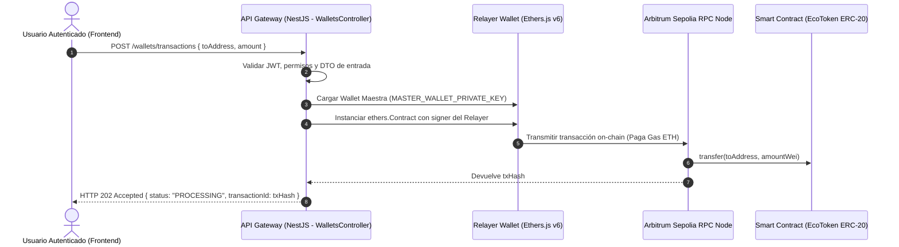

# Especificación Técnica Oficial: Módulos Transversales Finales (`WalletsModule`, `NotificationsModule`, `Consolidations`)

- **Proyecto:** Livora Backend (NestJS API Gateway & Microservicios)
- **Módulos:** `WalletsModule`, `NotificationsModule`, `ConsolidatedBatchesController`
- **Versión:** 1.0.0
- **Estado:** Implementado, Auditado y Verificado
- **Fecha:** Agosto 2026

---

## 1. Resumen y Propósito

Esta especificación documenta los tres módulos transversales finales que cierran el flujo funcional y financiero de la plataforma de reciclaje trazable Livora:

1. **Módulo de Billeteras y Saldos (`WalletsModule`):** 
   - Proporciona a los usuarios autenticados la lectura en tiempo real de sus saldos de EcoTokens (SEP-41) alojados en la red Stellar Testnet mediante Soroban RPC.
   - Implementa el patrón **Fee-Subsidized Relayer**, donde el backend actúa como pagador de comisiones de red utilizando la clave secreta del Worker (`WORKER_SECRET_KEY`), abstrayendo al usuario final de los costos de tarifas en XLM.

2. **Módulo de Notificaciones (`NotificationsModule`):**
   - Proporciona persistencia y gestión de alertas y mensajes del sistema (información, éxito y advertencias) vinculados a cada usuario.
   - Ofrece consulta paginada utilizando la DTO global `PaginationQueryDto` y cambio de estado de lectura (`isRead`).

3. **Consolidación de Lotes en Centro de Acopio (`Consolidations`):**
   - Permite a los Centros de Acopio (`CENTRO_ACOPIO`) agrupar múltiples lotes recibidos (`RECEIVED`) en un único lote industrial consolidado (`ConsolidatedBatch`) para su posterior venta B2B.
   - Ejecuta cálculos de pesaje total acumulado y actualizaciones masivas atómicas bajo transacciones ACID (`Prisma.$transaction`).

---

## 2. Modelos de Datos (Prisma Schema)

Los tres módulos extienden el esquema de base de datos de PostgreSQL con nuevos modelos y relaciones.

### 2.1 Enum y Modelo `Notification`
```prisma
enum NotificationType {
  INFO
  SUCCESS
  WARNING
}

model Notification {
  id        String           @id @default(uuid()) @db.Uuid
  userId    String           @db.Uuid
  title     String
  message   String
  type      NotificationType @default(INFO)
  isRead    Boolean          @default(false)
  createdAt DateTime         @default(now())

  user User @relation(fields: [userId], references: [id], onDelete: Cascade)

  @@map("notifications")
}
```

### 2.2 Enum y Modelo `ConsolidatedBatch`
```prisma
enum ConsolidatedStatus {
  PENDING_SALE
  SOLD
}

model ConsolidatedBatch {
  id          String             @id @default(uuid()) @db.Uuid
  centerId    String             @db.Uuid
  totalWeight Float
  status      ConsolidatedStatus @default(PENDING_SALE)
  createdAt   DateTime           @default(now())

  center  User    @relation("CenterConsolidations", fields: [centerId], references: [id])
  batches Batch[]

  @@map("consolidated_batches")
}
```

### 2.3 Actualización en los Modelos Existentes `User` y `Batch`
```prisma
model User {
  id                  String   @id @db.Uuid
  email               String   @unique
  role                Role
  walletAddress       String?  @unique
  encryptedPrivateKey String?
  receptionPin        String?
  createdAt           DateTime @default(now())
  updatedAt           DateTime @updatedAt

  householdRequests CollectionRequest[] @relation("HouseholdRequests")
  collectorRequests CollectionRequest[] @relation("CollectorRequests")

  collectorBatches     Batch[]             @relation("CollectorBatches")
  destinationBatches   Batch[]             @relation("DestinationBatches")
  notifications        Notification[]
  centerConsolidations ConsolidatedBatch[] @relation("CenterConsolidations")

  @@map("users")
}

model Batch {
  id                  String             @id @default(uuid()) @db.Uuid
  status              BatchStatus        @default(OPEN)
  collectorId         String             @db.Uuid
  destinationCenterId String?            @db.Uuid
  materialsActual     Json?
  consolidatedBatchId String?            @db.Uuid
  createdAt           DateTime           @default(now())
  updatedAt           DateTime           @updatedAt

  collector         User               @relation("CollectorBatches", fields: [collectorId], references: [id])
  destinationCenter User?              @relation("DestinationBatches", fields: [destinationCenterId], references: [id])
  consolidatedBatch ConsolidatedBatch? @relation(fields: [consolidatedBatchId], references: [id])
  requests          CollectionRequest[]

  @@map("batches")
}
```

---

## 3. Arquitectura del Relayer (Gas Subsidiado en Web3)

### 3.1 Desafío de UX en Web3
En una arquitectura descentralizada tradicional, si un usuario (Hogar o Recolector) desea transferir sus EcoTokens (ERC-20), necesitaría poseer Ether (`ETH`) en la red Arbitrum Sepolia para pagar la comisión de red (Gas Fee). Esto genera una barrera de entrada inaceptable para usuarios no técnicos.

### 3.2 Solución: Patrón Relayer
El backend de Livora actúa como un **Relayer Paga-Gas (Subsidized Transaction Relayer)**:



### 3.3 Garantías de Resiliencia y Fallback:
1. **Validación On-Chain:** `WalletsService` utiliza `ethers.JsonRpcProvider` conectado a Arbitrum Sepolia (`ARBITRUM_RPC_URL`).
2. **Transformación Decimal:** La cantidad ingresada por el usuario en unidades legibles (ej. `50` EcoTokens) es automáticamente transformada a Wei mediante `ethers.parseEther('50')` (18 decimales).
3. **Modo Simulado / Fallback:** En caso de entornos de desarrollo locales o ausencia de la llave privada maestra, el servicio emite una simulación determinista de hash (`0xrelayer...`) manteniendo la compatibilidad total del pipeline frontend sin interrumpir las pruebas de integración.

---

## 4. Catálogo de Endpoints

### 4.1 Billeteras (`WalletsController`)

#### `GET /wallets/me/balance`
- **Descripción:** Consulta el saldo de EcoTokens ERC-20 del usuario autenticado directamente desde el Smart Contract en Arbitrum Sepolia.
- **Autenticación:** Requiere `Authorization: Bearer <JWT>`.
- **Roles:** Todos los usuarios autenticados.
- **Respuesta de Éxito (HTTP 200 OK):**
  ```json
  {
    "balance": "150.5"
  }
  ```

#### `POST /wallets/transactions`
- **Descripción:** Transfiere EcoTokens a una dirección externa subsidiando la comisión de gas (Relayer Pattern). Devuelve respuesta asíncrona de inmediato.
- **Autenticación:** Requiere `Authorization: Bearer <JWT>`.
- **Roles:** Todos los usuarios autenticados.
- **Request Body (`CreateTransactionDto`):**
  ```json
  {
    "toAddress": "0x1234567890abcdef1234567890abcdef12345678",
    "amount": 50
  }
  ```
- **Respuesta de Éxito (HTTP 202 Accepted):**
  ```json
  {
    "status": "PROCESSING",
    "transactionId": "0xrelayer8a4f91b...",
    "message": "Transacción subsidiada por el Relayer y enviada a la red Arbitrum Sepolia",
    "fromUser": "ciudadano@livora.io",
    "toAddress": "0x1234567890abcdef1234567890abcdef12345678",
    "amount": 50
  }
  ```

---

### 4.2 Notificaciones (`NotificationsController`)

#### `GET /notifications`
- **Descripción:** Devuelve la lista paginada de notificaciones del usuario autenticado ordenadas por fecha descendente.
- **Autenticación:** Requiere `Authorization: Bearer <JWT>`.
- **Query Params:** Extiende de `PaginationQueryDto` (`?page=1&limit=20&sortBy=createdAt&sortOrder=DESC`).
- **Respuesta de Éxito (HTTP 200 OK):**
  ```json
  [
    {
      "id": "a1b2c3d4-e5f6-7a8b-9c0d-1e2f3a4b5c6d",
      "userId": "b3c4d5e6-f7a8-9b0c-1d2e-3f4a5b6c7d8e",
      "title": "Recolección Confirmada",
      "message": "Tu solicitud de recolección fue recibida exitosamente.",
      "type": "SUCCESS",
      "isRead": false,
      "createdAt": "2026-08-04T20:00:00.000Z"
    }
  ]
  ```

#### `PATCH /notifications/:id`
- **Descripción:** Actualiza el estado de lectura (`isRead`) de una notificación perteneciente al usuario.
- **Autenticación:** Requiere `Authorization: Bearer <JWT>`.
- **Request Body (`UpdateNotificationDto`):**
  ```json
  {
    "isRead": true
  }
  ```
- **Respuesta de Éxito (HTTP 200 OK):**
  ```json
  {
    "id": "a1b2c3d4-e5f6-7a8b-9c0d-1e2f3a4b5c6d",
    "userId": "b3c4d5e6-f7a8-9b0c-1d2e-3f4a5b6c7d8e",
    "title": "Recolección Confirmada",
    "message": "Tu solicitud de recolección fue recibida exitosamente.",
    "type": "SUCCESS",
    "isRead": true,
    "createdAt": "2026-08-04T20:00:00.000Z"
  }
  ```

---

### 4.3 Consolidaciones (`ConsolidatedBatchesController`)

#### `POST /consolidated-batches`
- **Descripción:** Consolida múltiples lotes en estado `RECEIVED` en un único `ConsolidatedBatch` con estado `PENDING_SALE`, sumando los pesos pesados en la recepción industrial.
- **Autenticación:** Requiere `Authorization: Bearer <JWT>`.
- **Roles Permitidos:** `CENTRO_ACOPIO`.
- **Request Body (`CreateConsolidatedBatchDto`):**
  ```json
  {
    "batchIds": [
      "123e4567-e89b-12d3-a456-426614174000",
      "987e6543-e21b-12d3-a456-426614174111"
    ]
  }
  ```
- **Respuesta de Éxito (HTTP 201 Created):**
  ```json
  {
    "id": "f47ac10b-58cc-4372-a567-0e02b2c3d479",
    "centerId": "c0a80101-0000-0000-0000-000000000001",
    "totalWeight": 245.5,
    "status": "PENDING_SALE",
    "createdAt": "2026-08-04T20:15:00.000Z",
    "batches": [
      {
        "id": "123e4567-e89b-12d3-a456-426614174000",
        "status": "CONSOLIDATED",
        "consolidatedBatchId": "f47ac10b-58cc-4372-a567-0e02b2c3d479"
      },
      {
        "id": "987e6543-e21b-12d3-a456-426614174111",
        "status": "CONSOLIDATED",
        "consolidatedBatchId": "f47ac10b-58cc-4372-a567-0e02b2c3d479"
      }
    ],
    "center": {
      "id": "c0a80101-0000-0000-0000-000000000001",
      "email": "centro.acopio@livora.io"
    }
  }
  ```

---

## 5. Matriz de Errores y Códigos de Respuesta

Todas las excepciones emitidas por estos controladores son capturadas y estandarizadas por el `GlobalExceptionFilter` de Livora:

| Código HTTP | Error Code | Causa Frecuente |
| :--- | :--- | :--- |
| `400 Bad Request` | `BAD_REQUEST` | Formato inválido de `toAddress`, `amount` negativo, lista de `batchIds` vacía o lotes que no están en estado `RECEIVED`. |
| `401 Unauthorized` | `UNAUTHORIZED` | Token JWT omitido, caducado o firma no válida en la cabecera `Authorization`. |
| `403 Forbidden` | `FORBIDDEN` | Usuario con rol distinto a `CENTRO_ACOPIO` intentando consolidar lotes, o intentar marcar como leída una notificación ajena. |
| `404 Not Found` | `NOT_FOUND` | Lote o notificación no encontrados por UUID. |
| `500 Internal Error` | `INTERNAL_SERVER_ERROR` | Fallo de conexión crítico con el nodo RPC de Arbitrum Sepolia. |
